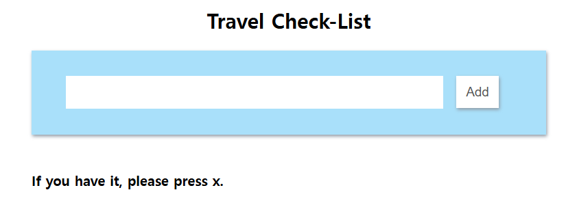
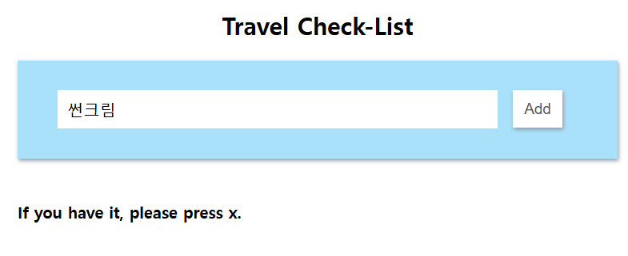
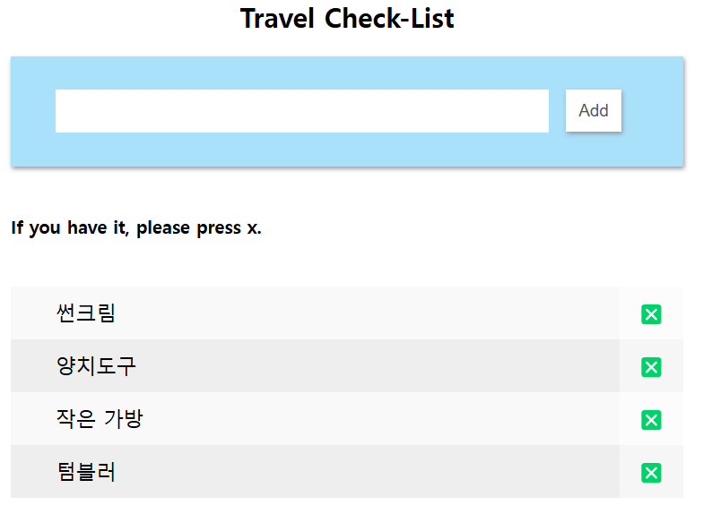
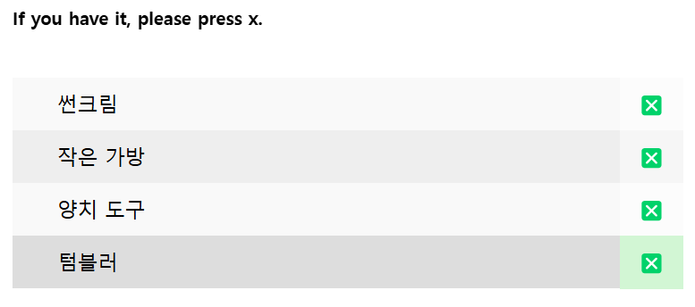
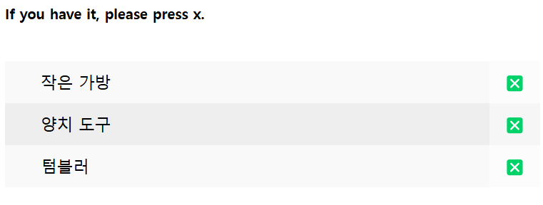

> 소스 파일  
- html 파일 : diy-itemList.html
- css 파일 : diy-input.css, diy-list.css
- js 파일 : diy-itemList.js

---
### Travel Check-List

 

<b>1. 입력창에 확인할 물건 입력

<b>2. Add 버튼 누르기

- 아래에 추가한 물건들 리스트가 있는 걸 확인할 수 있다.
 

<b>3. 삭제하려면 X 버튼을 누르면 된다.

- 커서를 삭제할 항목에 가져다 대면 색깔이 변한다.
  

- X버튼 누른 후, 삭제된 모습

