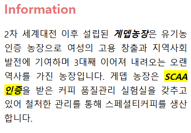

## 08-1 문서 객체 모델이란?<br>
> DOM의 정의 <br>

웹 문서의 모든 요소를 자바스크립트를 이용하여 조작할 수 있도록 객체를 사용해 문서를 해석하는 방법
<br>

### DOM 트리 - DOM 구조는 나무처럼 생겼다
> DOM 트리 웹 문서 요소 표현

    ___body__
    |        | -> (가지)
    h1       p -> (노드)
    |        |
   '제목'   '본문'

- 웹 문서의 태그는 요소(Element) 노드로 표현.
- Tag가 품고 있는 Text는 해당 요소 노드(Tag)의 자식 노드인 Text 노드로 표현.
- Tag의 속성은 모두 해당 요소 노드(Tag)의 자식 노드인 속성(Attribute) 노드로 표현
- 주석은 주석(Comment) 노드로 표현.

> 실시간으로 DOM 트리 만들어지는 과정 보기

[Live DOM Viewer](http://software.hixie.ch/utilities/js/live-dom-viewer/)
<br>

<br>


## 08-2 DOM 요소에 접근하기
> <b>DOM 요소를 id 선택자로 접근하는 함수 - <code>getElementById()</code></b>

ex)
```javascript
doucment.getElementById("heading").onclick = function() {
    this.style.fontSize = "5em"
}
```
<코드 실행 전><br>


<코드 실행 후><br>


> <b>DOM 요소를 class 값으로 찾아내는 함수 - <code>getElementsByClassName()</code></b>

- class 선택자는 id 선택자와 다르게 웹 문서 안에서 여러 번 사용할 수 있다.
- 2개 이상의 웹 요소에 접근한다.

ex)
```javascript
document.getElementsByClassName("accent")[0].style.textDecoration = "underline"
```

<코드 실행 전><br>


<코드 실행 후><br>


> <b>DOM 요소를 태그 이름으로 찾아내는 함수 - <code>getElementsByTagName()</code></b>

- id나 class 선택자가 없는 DOM 요소에 접근할 수 있다.

ex)
```javascript
document.getElementsByTagName("h2")[0].style.backgroundColor = "tree"
```
<코드 실행 전><br>


<코드 실행 후><br>


> <b>DOM 요소를 다양한 방법으로 찾아주는 함수 - <code>querySelector(), querySelectorAll()</code></b>

- 두 함수는 id, class 값을 사용해도 되고 태그 이름을 사용해도 된다.
- CSS 선택자를 사용한 방법처럼
    - class 값 앞에는 마침표(.) 붙이기
    - id 값 앞에는 샵(#) 붙이기

ex) <br>
- id="heading"인 제목 요소를 querySelector() 함수로 접근
```javascript
document.querySelector("#heading")
```


- class 값이 accent인 DOM 요소에 접근
```javascript
document.querySelectorAll(".accent")
```


- NodeList의 2번째 요소에 접근한 다음 요소의 배경색을 노란색으로 변경
```javascript
document.querySelectorAll(".accent")[1].style.backgroundColor="yellow"
```


> getElementById()와 querySelector()함수 차이

| getElementById() | querySelector() |
|---|---|
