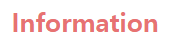

## 08-1 문서 객체 모델이란?<br>
#### ❄️ DOM의 정의 <br>

웹 문서의 모든 요소를 자바스크립트를 이용하여 조작할 수 있도록 객체를 사용해 문서를 해석하는 방법
<br>

### DOM 트리 - DOM 구조는 나무처럼 생겼다
#### ❄️ DOM 트리 웹 문서 요소 표현

```
    ___body__
    |        | -> (가지)
    h1       p -> (노드)
    |        |
   '제목'   '본문'
```

- 웹 문서의 태그는 요소(Element) 노드로 표현.
- Tag가 품고 있는 Text는 해당 요소 노드(Tag)의 자식 노드인 Text 노드로 표현.
- Tag의 속성은 모두 해당 요소 노드(Tag)의 자식 노드인 속성(Attribute) 노드로 표현
- 주석은 주석(Comment) 노드로 표현.

#### ❄️ 실시간으로 DOM 트리 만들어지는 과정 보기

[Live DOM Viewer](http://software.hixie.ch/utilities/js/live-dom-viewer/)
<br>


## 08-2 DOM 요소에 접근하기
### DOM 요소를 id 선택자로 접근하는 함수 - <code>getElementById()</code>

ex)
```javascript
doucment.getElementById("heading").onclick = function() {
    this.style.fontSize = "5em"
}
```
<코드 실행 전><br>


<코드 실행 후><br>

<br>

---

### DOM 요소를 class 값으로 찾아내는 함수 - <code>getElementsByClassName()</code>

- class 선택자는 id 선택자와 다르게 웹 문서 안에서 여러 번 사용할 수 있다.
- 2개 이상의 웹 요소에 접근한다.

ex)
```javascript
document.getElementsByClassName("accent")[0].style.textDecoration = "underline"
```

<코드 실행 전><br>


<코드 실행 후><br>

<br>

---

### DOM 요소를 태그 이름으로 찾아내는 함수 - <code>getElementsByTagName()</code>

- id나 class 선택자가 없는 DOM 요소에 접근할 수 있다.

ex)
```javascript
document.getElementsByTagName("h2")[0].style.backgroundColor = "tree"
```
<코드 실행 전><br>



<코드 실행 후><br>


<br>

---

### DOM 요소를 다양한 방법으로 찾아주는 함수 - <code>querySelector(), querySelectorAll()</code>

- 두 함수는 id, class 값을 사용해도 되고 태그 이름을 사용해도 된다.
- CSS 선택자를 사용한 방법처럼
    - class 값 앞에는 마침표(.) 붙이기
    - id 값 앞에는 샵(#) 붙이기

ex) <br>
- id="heading"인 제목 요소를 querySelector() 함수로 접근
```javascript
document.querySelector("#heading")
```


- class 값이 accent인 DOM 요소에 접근
```javascript
document.querySelectorAll(".accent")
```


- NodeList의 2번째 요소에 접근한 다음 요소의 배경색을 노란색으로 변경
```javascript
document.querySelectorAll(".accent")[1].style.backgroundColor="yellow"
```

<br>

#### 🔎 getElementById()와 querySelector()함수 차이

| | getElementById() | querySelector() |
|---|---|---|
| <b>특징</b> | - DOM의 노드 중, 요소 노드까지만 접근 가능.| - 요소 노드 뿐만 아니라 텍스트 노드, 속성까지 접근 가능. |
| <b>해당하는 또 다른 함수</b> | getElementsByClassName(), getElementsByTagName() | querySelector(), querySelectorAll() |
| <b>사용</b> | 웹 요소 정도만 변경 | 웹 요소뿐만 아니라 요소의 텍스트나 속성 변경 및 새로운 노드 추가

<br>

## 08-3 웹 요소의 태그 속성 가져와서 수정하기

### HTML 태그 속성을 가져오거나 수정하는 함수 - <code>getAttribute(), setAttribute()</code>

❄️ 선택한 상품 이미지를 특정 위치에 표시하기
1. 작은 이미지 src 속성에 접근해서 값을 알아낸다.
2. 큰 이미지의 src 속성에 접근해서 작은 이미지의 src 값으로 변경한다.

- querySelector() : 이미지 요소에 접근
- getAttribute() : 속성에 접근
- setAttribute() : 접근한 속성의 값 변경

<br>

## 08-4 DOM에서 이벤트 처리하기

### 이벤트 처리 방법 복습
1. HTML 태그 안에서 이벤트 처리기 연결
```javascript
<div id="container">
    
</div>
<script>
    var pic = document.querySelector('#pic');   // 누르면 change-Pic() 실행
    function changePic() {
        pic.src = "imges/boy.png";
    }
</script>
```
2. DOM 요소에 이벤트 처리기 연결
```javascript
<div id="container">
    
</div>
<script>
    var pic = document.querySelector('#pic');
    pic.onclick = changePic;    //pic 요소 누르면 changePic() 함수 실행
    function changePic() {
        pic.src = "imges/boy.png";
    }
</script>
```

### <code>addEventListener()</code> 함수 사용하기
> addEventListener(event type, func, capture state) 
- 이벤트 유형(event type) : 처리할 이벤트 유형 지정. on 붙이지 않고 이벤트 이름만 사용. ex) click, mouseover
- 함수(func) : 이벤트 발생 시 실행할 명령어 나열 or 따로 만든 함수 실행.
- 캡처 여부(capture state) : true이면 캡처링, false이면 버블링. 기본값은 false
    - 캡처링 : DOM의 부모 노드에서 자식 노드로 이벤트가 전달.
    - 버블링 : dom의 자식 노드에서 부모 노드로 이벤트가 전달.

<br>

## 08-5 웹 요소의 스타일 가져와서 수정하기

### 웹 요소를 화면에 표시하기/감추기


