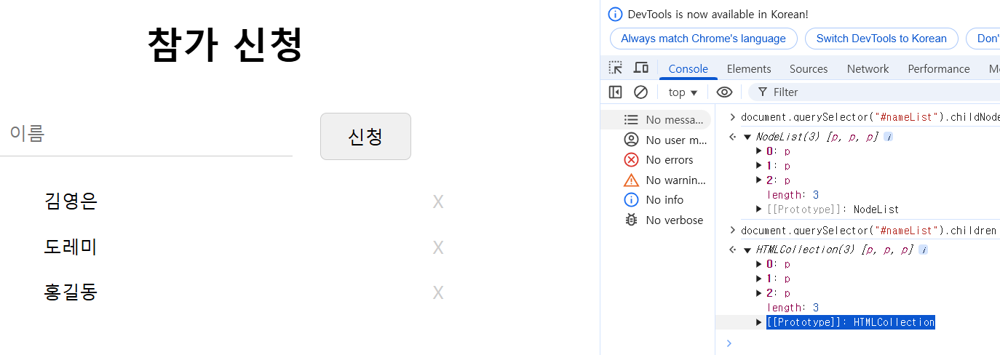
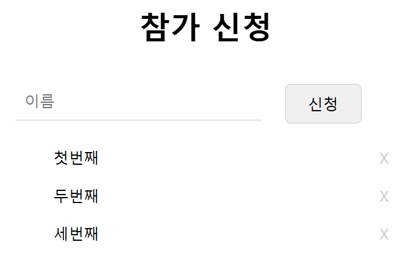
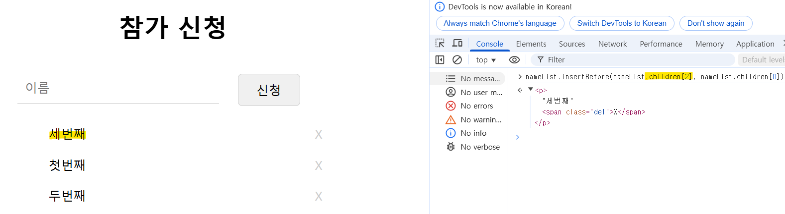
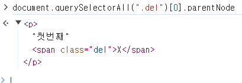
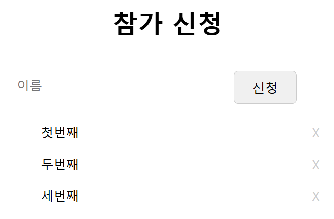
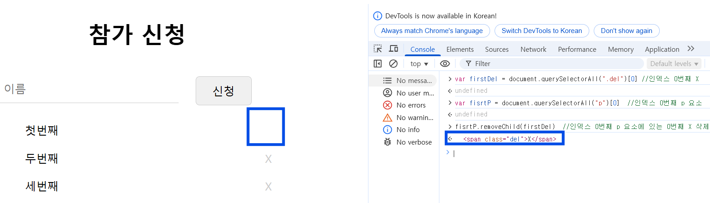

## 08-1 문서 객체 모델이란?<br>
#### ❄️ DOM의 정의
웹 문서의 모든 요소를 자바스크립트를 이용하여 조작할 수 있도록 객체를 사용해 문서를 해석하는 방법
<br>

### DOM 트리 - DOM 구조는 나무처럼 생겼다
#### ❄️ DOM 트리 웹 문서 요소 표현

```
    ___body__
    |        | -> (가지)
    h1       p -> (노드)
    |        |
   '제목'   '본문'
```

- 웹 문서의 태그는 요소(Element) 노드로 표현.
- Tag가 품고 있는 Text는 해당 요소 노드(Tag)의 자식 노드인 Text 노드로 표현.
- Tag의 속성은 모두 해당 요소 노드(Tag)의 자식 노드인 속성(Attribute) 노드로 표현
- 주석은 주석(Comment) 노드로 표현.

#### ❄️ 실시간으로 DOM 트리 만들어지는 과정 보기

[Live DOM Viewer](http://software.hixie.ch/utilities/js/live-dom-viewer/)
<br>


## 08-2 DOM 요소에 접근하기
📁Src : [acessDom.html](acessDom.html), [css/dom.css](css/dom.css)

### DOM 요소를 id 선택자로 접근하는 함수 - <code>getElementById()</code>

ex)
```javascript
doucment.getElementById("heading").onclick = function() {
    this.style.fontSize = "5em"
}
```
<코드 실행 전><br>


<코드 실행 후><br>

<br>

---

### DOM 요소를 class 값으로 찾아내는 함수 - <code>getElementsByClassName()</code>

- class 선택자는 id 선택자와 다르게 웹 문서 안에서 여러 번 사용할 수 있다.
- 2개 이상의 웹 요소에 접근한다.

ex)
```javascript
document.getElementsByClassName("accent")[0].style.textDecoration = "underline"
```

<코드 실행 전><br>


<코드 실행 후><br>

<br>

---

### DOM 요소를 태그 이름으로 찾아내는 함수 - <code>getElementsByTagName()</code>

- id나 class 선택자가 없는 DOM 요소에 접근할 수 있다.

ex)
```javascript
document.getElementsByTagName("h2")[0].style.backgroundColor = "tree"
```
<코드 실행 전><br>


<코드 실행 후><br>


<br>

---

### DOM 요소를 다양한 방법으로 찾아주는 함수 - <code>querySelector(), querySelectorAll()</code>

- 두 함수는 id, class 값을 사용해도 되고 태그 이름을 사용해도 된다.
- CSS 선택자를 사용한 방법처럼
    - class 값 앞에는 마침표(.) 붙이기
    - id 값 앞에는 샵(#) 붙이기

ex) <br>
- id="heading"인 제목 요소를 querySelector() 함수로 접근
```javascript
document.querySelector("#heading")
```


- class 값이 accent인 DOM 요소에 접근
```javascript
document.querySelectorAll(".accent")
```


- NodeList의 2번째 요소에 접근한 다음 요소의 배경색을 노란색으로 변경
```javascript
document.querySelectorAll(".accent")[1].style.backgroundColor="yellow"
```

<br>

#### 🔎 getElementById()와 querySelector()함수 차이

| | getElementById() | querySelector() |
|---|---|---|
| <b>특징</b> | - DOM의 노드 중, 요소 노드까지만 접근 가능.| - 요소 노드 뿐만 아니라 텍스트 노드, 속성까지 접근 가능. |
| <b>해당하는 또 다른 함수</b> | getElementsByClassName(), getElementsByTagName() | querySelector(), querySelectorAll() |
| <b>사용</b> | 웹 요소 정도만 변경 | 웹 요소뿐만 아니라 요소의 텍스트나 속성 변경 및 새로운 노드 추가

<br>

## 08-3 웹 요소의 태그 속성 가져와서 수정하기
📁Src : [showBig.html](showBig.html), [css/product.css](css/product.css), [js/product.js](js/product.js)

### HTML 태그 속성을 가져오거나 수정하는 함수 - <code>getAttribute(), setAttribute()</code>

❄️ 선택한 상품 이미지를 특정 위치에 표시하기
1. 작은 이미지 src 속성에 접근해서 값을 알아낸다.
2. 큰 이미지의 src 속성에 접근해서 작은 이미지의 src 값으로 변경한다.

- querySelector() : 이미지 요소에 접근
- getAttribute() : 속성에 접근
- setAttribute() : 접근한 속성의 값 변경

<br>

## 08-4 DOM에서 이벤트 처리하기
📁Src : [product.html](product.html), [css/product.css](css/product.css), [js/product.js](js/product.js)

### 이벤트 처리 방법 복습
1. HTML 태그 안에서 이벤트 처리기 연결
```javascript
<div id="container">
    
</div>
<script>
    var pic = document.querySelector('#pic');   // 누르면 change-Pic() 실행
    function changePic() {
        pic.src = "imges/boy.png";
    }
</script>
```
2. DOM 요소에 이벤트 처리기 연결
```javascript
<div id="container">
    
</div>
<script>
    var pic = document.querySelector('#pic');
    pic.onclick = changePic;    //pic 요소 누르면 changePic() 함수 실행
    function changePic() {
        pic.src = "imges/boy.png";
    }
</script>
```

### <code>addEventListener()</code> 함수 사용하기
> addEventListener(event type, func, capture state) 
- 이벤트 유형(event type) : 처리할 이벤트 유형 지정. on 붙이지 않고 이벤트 이름만 사용. ex) click, mouseover
- 함수(func) : 이벤트 발생 시 실행할 명령어 나열 or 따로 만든 함수 실행.
- 캡처 여부(capture state) : true이면 캡처링, false이면 버블링. 기본값은 false
    - 캡처링 : DOM의 부모 노드에서 자식 노드로 이벤트가 전달.
    - 버블링 : dom의 자식 노드에서 부모 노드로 이벤트가 전달.

<br>

## 08-5 웹 요소의 스타일 가져와서 수정하기

### 웹 요소를 화면에 표시하기/감추기
<순서>
1. id="view"인 요소를 가져온다.
2. view를 눌렀을 때 함수를 실행한다.
    - 상세 정보가 감추어져 있을 때 실행할 소스
    - 상세 정보가 표시되어 있을 때 실행할 소스

```javascript
var view = document.querySelector("#view"); //view 요소 가져옴
view.addEventLitener("click", function(){
    if(isOpen == false) {
        document.querySelector("#detail").style.display = "block";  //상세 정보를 화면에 표시
        view.innerText = "상세 설명 닫기";  //링크 내용 수정
        isOpen = true;  //표시 상태로 저장
    }

    else {
        document.querySelector("#detail").style.display = "none";   //상세 정보를 화면에서 감춤.
        view.innerText = "상세 설명 열기";  //링크 내용 수정
        isOpen = true;  //감춘 상태로 저장
    }
});
```

## 08-6 DOM에 요소 추가하기
📁Src : [register-create.html](register-create.html), [css/nameList.css](css/nameList.css), [js/register-create.js](js/register-create.js)

```
<p class="accent">오므라이스</p>
```
- ```<p > </p>``` : p 요소 노드
- ```class="accent"``` : 속성 노드
- ```오므라이스``` : 텍스트 노드

| 번호 | 함수               | 설명 |
|------|-------------------|------|
| 1    | createElement()   |새 요소 노드를 만듦.|
| 2-1  | createTextNode()  |텍스트 내용이 있을 경우, 텍스트 노드 만듦.|
|      | appendChild()     |텍스트 노드를 요소 노드에 자식 노드로 추가.|
| 2-2  | createAttribute() |요소에 속성이 있을 경우, 속성 노드 만듦.|
|      | setAttributeNode()|속성 노드를 요소 노드에 연결.|
| 3    | appendChild()     |새로 만든 요소 노드를 부모 노드에 추가.|

<br>

## 08-7 추가한 노드 순서 바꾸거나 삭제하기
📁Src : [register.html](register.html),[css/nameList.css](css/nameList.css),[js/register.js](js/register.js)

## DOM 트리를 활용해 원하는 노드 다루기
### 자식 노드 확인하기  
- <code>hasChildNodes()</code> : 특정 노드에 자식 노드가 있는지 확인하는 함수. 
- 자식 노드 있으면 true 없으면 false.
### 자식 노드에 접근하기 
- <code>ch1ildNodes()</code> : 현재 노드의 자식 노드에 접근하는 함수. 
- 요소 노드, 태그와 태그 사이의 줄바꿈도 자식 노드로 인식(빈 텍스트 노드)

#### 🔎 요소에만 접근하려면 <code>children</code> 속성 사용.  
- childNodes 속성 : 요소 노드, 텍스트 노드 접근
- children 속성 : 요소 노드만 접근


- 3개의 p 요소만 가져옴.
- HTMLCollection : 요소만 가져와 저장된 자료형


### 원하는 위치에 노드 삽입하기 
- <code>insertBefore()</code> : 부모 노드에 자식 노드를 추가할 때, 기준이 되는 노드 지정과 그 앞에 자식 노드 추가함.
- <code>appendChild()</code>는 부모 노드에 자식 노드가 있을 때만 마지막 자식 노드로 추가됨.

<br>

```<insertBefore>``` 사용하기 전

```<insertBefore>``` 사용 후 - 인덱스 2번이 가장 앞으로 온 것을 확인할 수 있다.


### 특정 노드 삭제하기 
- <code>removeChild()</code> : DOM 트리에 있는 노드 삭제하는 함수.
- <code>parentNode</code> 속성 : 부모 노드 정보를 가지고 있다. 현재 노드의 부모 요소 노드 반환함.    
    - 노드는 스스로 자신을 삭제할 수 없으므로 부모 노드에 접근 후, 부모 노드에서 삭제해야 함.

<br>

<```<span class="del">X</span>```요소의 부모 요소 확인하기>


- p요소가 부모 요소인 것을 알 수 있다.

<```removeChild()```함수 사용해서 인덱스 0번째 요소 삭제하기>

<삭제 전>


<삭제 후>

- removeChild()가 삭제된 노드를 반환하고
- 0번째 X가 사라진 것을 확인할 수 있다.

<br>

## 연습 문제
1. 자바스크립트를 이용하여 조작할 수 있도록 객체를 사용해 문서를 해석하는 방법을 (문서 객체 모델(DOM))이라고 합니다.
2. (DOM트리)는 웹 문서 요소 간의 관계를 가지와 노드로 표현한 것입니다.
3. DOM트리는 HTML 요소 외에 태그의 내용이나 속성들을 (포함합니다).
4. class 값이 small인 모든 요소에 접근하려면 document 객체의 (queryselectAll(".small"))을 사용합니다.
5. DOM에서 이벤트를 처리하기 위해 사용하는 함수는 (addEventListener) 입니다.
6. DOM에서 문서의 배경색을 바꾸려면 document.body.style.backgroundColor = "black" 라고 작성합니다.
7. 웹 문서에서 무엇인가를 화면에 표시하거나 감출 때 (display) 속성을 사용해서 감추면 그 요소가 차지하던 공간도 사라지지만, (visibility) 속성을 사용해서 감추면 요소가 있던 공간이 빈 상태로 남아 있게 됩니다.
8. 하나의 변수에 여러 개의 노드가 저장된 것을 (노드 리스트)라고 합니다.

Q1. 08/quiz-1.html
텍스트 단락을 누르면 글자 크기를 20px로, 글자색을 blue로 바꾸고 배경색은 #ccc로 지정하는 소스를 작성하시오.

Q2. 08/quiz-2.html
각 항목 앞에 있는 체크 표시를 노르면 항목 텍스트의 글자 색이 #ccc로 바뀌도록 소스를 작성하세요.


