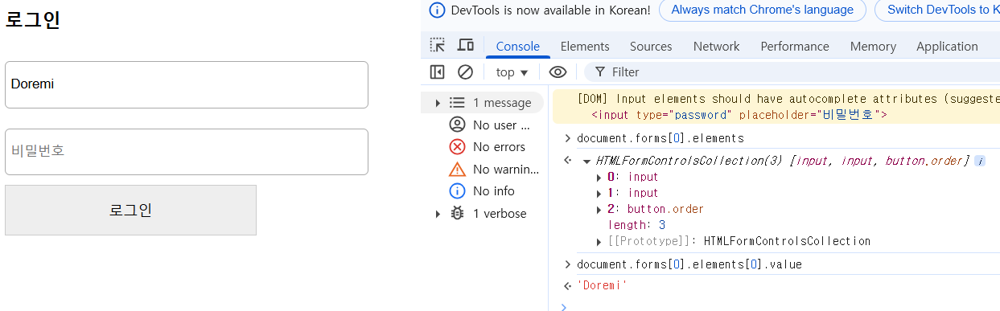
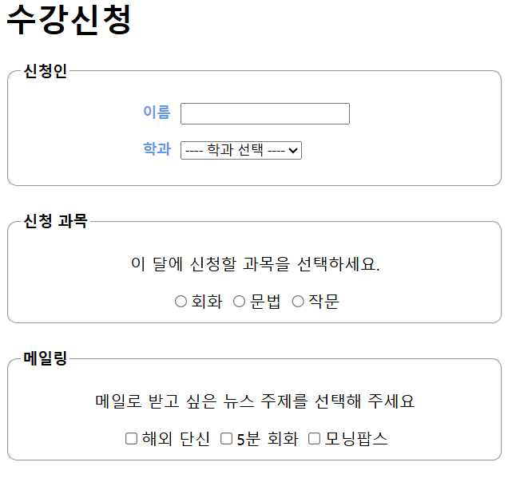
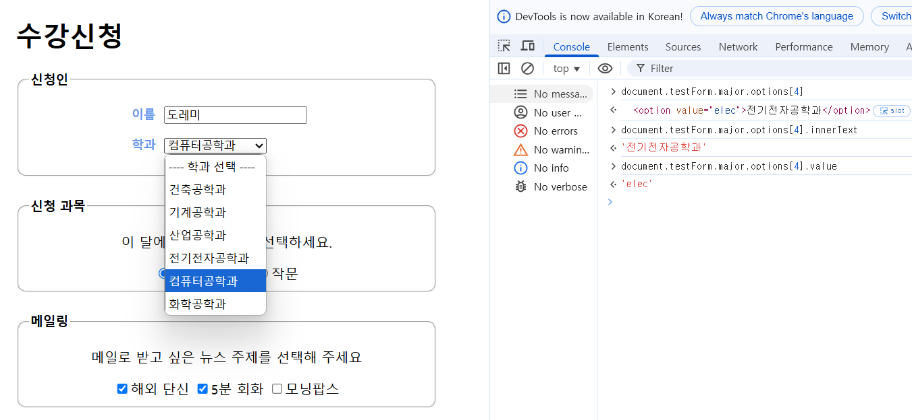
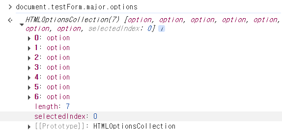
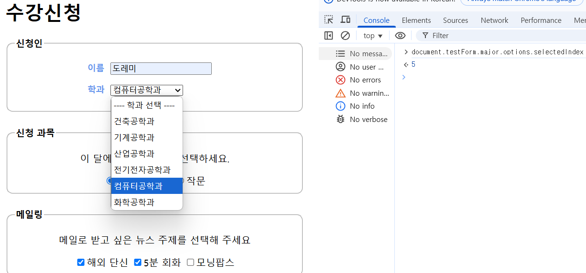
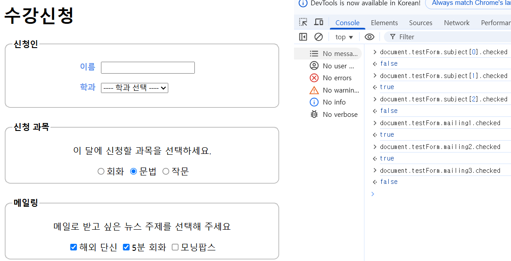

## 09-1 폼 요소에 접근하는 여러 가지 방법<br>

📁Src : [order.html](order.html), [css/order.css](css/order.css), [js/order.js](js/order.js), [reg.html](reg.html)

### 1. id 값이나 class 값을 사용해 폼 요소에 접근하기
- ```querySelector(), querySelectorAll()``` 함수로 특정 id 값이나 class 값을 가진 요소에 접근할 수 있다.
    - id 값을 사용할 때 : 폼 요소 하나에만 접근
        - id 접근 : id 값 앞에 샾(#) 붙이기
    - class 값을 사용할 때 : 여로 요소를 가져와 배열 형태로 저장.
        - class 접근 : class 값 앞에 마침표(.) 붙이기

```javascript
document.querySelector("#bilingName")
document.querySelector("#billingName").value  //텍스트 필드에 있는 값 가져오기
```


[1분 복습] 연락처 필드에 입력한 번호 가져오는 방법?
<code>document.querySelector("#billingTel").value</code>

### 2. name 값을 사용해 폼 요소에 접근하기

- 폼 요소에 id나 class 속성이 없고 name 속성만 있다면 name 식별자로 폼 요소에 접근 가능.
- 이 방법을 사용하려면
    - ```<form>``` 태그에 ```name``` 속성이 지정되어 있어야 하고, ```<form>``` 태그 안에 포함된 폼 요소에도 ```name``` 속성이 있어야 함.

```javascript
document.ship.shippingName                      //'배송 정보' 중 [이름:] 항목의 텍스트 필드에 접근하는 소스
document.forms["ship"].elements["shippingName"] //다른 방법으로 접근

document.ship.shippingName.value    //입력한 값 가져오기
```


[1분 복습] '배송 정보' 중 [주소] 항목에 내용을 입력했을 때, name 속성을 사용해 가져오는 방법?
document.forms["ship"].elements["shippingAddr"].value


### 3. 폼 배열을 사용해 폼 요소에 접근하기
- forms 속성 : 문서 안에 있는 ```<form>``` 태그를 모두 가져와 배열 형태로 반환.
- form 요소에 id 속성, class 속성, name 속성 모두 없을 때 사용.


```javascript
    document.forms[0].elements
    document.forms[0].elements[0].value     //현재 문서의. 첫 번째 form의. 첫 번째 요소의. 값
    // 0: input         //```<input>``` 태그 (아이디)
    // 1: input         //```<input>``` 태그 (비밀번호)
    // 2: button.order  //```<button>``` 태그 (class="order)
```



## 09-2 폼 요소에서 입력값 검증하기
📁Src : [register.html](register.html), [css/register.css](css/register.css), [js/register.js](js/register.js)

### 입력값 검증 프로그램 - 아이디 글자 수 확인하기
- change 이벤트 : 텍스트 필드 안의 내용이 바뀔 때(ID 필드에 입력 마치고 그 필드 빠져나올 때) 발생하는 이벤트

```javascript
var userId = document.querySelector("#user-id");    //[아이디] 필드를 가져와 변수에 저장

userId.onchange = checkId;

function checkId(){
    //userId 필드 내용의 길이가 4이하이거나 15 이상일 경우
    if(userId.value.length < 4 || userId.value.length > 15) {
        alert("4~15자리의 영문과 숫자를 사용하세요.");
        userId.select();    //다시 입력하도록 입력된 정보 드래그 함.
    }
}
```

### 입력값 검증 프로그램 - 비밀번호 확인하기
- ```select()``` : 사용자가 기존에 입력한 값을 드래그 함.
- ```focus()``` : 기존에 입력한 값이 지워진 자리에 새로운 값을 입력하도록 텍스트 필드에 커서를 가져다 놓음.

```javascript
var pw1 = document.querySelector("#user-pw1");      //[비밀번호] 필드를 가져와 변수에 저장
var pw2 = document.querySelector("#user-pw2");      //[비밀번호 확인] 필드를 가져와 변수에 저장

pw1.onchange = checkPw;
pw2.onchange = comparePw;

function checkPw(){
    if(pw1.value.length < 8) {      //pw1 필드 길이가 8자리 이하일 경우
        alert("비밀번호는 8자리 이상이어야 합니다.");
        pw1.value = ""; // [비밀번호] 필드 지우고
        pw1.focus();    // 다시 입력하도록 커서를 포커싱 함.
    }
}

function comparePw(){
    if(pw1.value != pw2.value) {    //pw1 내용과 같지 않으면
        alert("비밀번호는 8자리 이상이어야 합니다.");
        pw2.value = ""; //[비밀번호 확인] 필드 지우고
        pw2.focus();    // 다시 입력하도록 커서를 포커싱 함.
    }
}
```

#### 🔎태그 자체에서 폼 검증하기
***```<input>``` 태그의 새로운 유형***
|유형|설명|
|---|---|
|```<input type = "email">``` | 이메일 주소 필드. 이메일 주소 형식에 맞지 않으면 오류 메시지 표시|
|```<input type = "tel">``` | 전화번호나 숫자가 아닌 내용을 이력하면 오류 메시지 표시|
|```<input type = "url">```| 이메일 주소 필드. 이메일 주소 형식에 맞지 않으면 오류 메시지 표시|


***```<input>``` 태그의 새로운 속성***
|속성|설명|
|---|---|
|autocomplete|자동 완성 기능을 켜고 끄는 속성|
|autofocus|해당 필드에 마우스 커서를 자동으로 표시|
|placeholder|필드 안에 힌트가 표시되어 사용자에게 어떤 내용을 입력해야 하는지 알려줌. 필드 내부를 누르면 표시된 힌트가 사라짐.|
|required|필수 입력 항목으로 지정. 필드가 작성되지 않으면 오류 메시지를 표시하며 다음 단계로 넘어갈 수 없음.|

## 09-3 다양한 폼 요소 다루기
📁Src : [getForm.html](getForm.html), [css/getForm.css](css/getForm.css), [js/getForm.js](js/getForm.js)



### 선택 목록 및 옵션 항목에 접근하기
- 선택 목록 : \<option> 태그를 사용해 여러 항목을 한꺼번에 지정한 뒤 목록을 펼쳐 원하는 항목을 선택할 수 있는 요소
    - = 팝업 메뉴, select 메뉴, select 목록

<br>
<br>

- 폼 요소에 id, class, name 같은 속성이 없을 경우 배열을 사용해 접근함.
    - forms : 폼에 접근
    - options : 폼 요소에 접근

<br>
<br>

- 선택 목록 중 5번째 옵션 항목에 접근
```javascript
document.testForm.major.options[4]  //5번째 옵션 항목에 접근
```
- innerText 속성 : 5번째 옵션이 화면에 표시하는 내용에 접근
```javascript
document.testForm.major.options[4].innerText  //5번째 옵션 항목의 화면 표시 내용
```

- 5번째 옵션 항목 선택 시, 어떤 값을 서버로 넘겨주는지 알고 싶을 때
```javascript
document.testForm.major.options[4].value  //5번째 옵션의 서버 전달 값
```


[1분 복습] getForm.html 문서에 선택 목록 중, 3번째 항목이 화면에 표시하는 내용을 가져오는 코드 작성.
```javascript
document.testForm.major.options[2].innerText;
```

### 선택 목록에서 사용자가 선택한 옵션 찾아내기

- 선택 목록에 접근하면 배열 형태 반환.
- 배열 안에 selectedIndex 속성이 있음.
<br>
<br>

- ```selectedIndex``` 속성 : 사용자가 선택 목록에서 선택한 항목의 인덱스 값이 저장됨.
    - 이 값을 통해 사용자가 어떤 항목을 선택했는지 알 수 있음.


<br>
<br>

> displaySelect() - 알림창 표시 기능

```javascript
var selectMenu = document.testForm.major;
function displaySelect(){
    var selectedText = selectMenu.options[selectMenu.selectedIndex].innerText;
    alert("[" + selectedText +"]를 선택했습니다.");
}
```

### 라디오 버튼과 체크 상자에 접근하기
- ```RadioNodeList``` : 라디오 버튼과 같은 name 값을 가진 요소가 여러 개일 때 RadioNodeList 형태로 저장.

<br>

- ```checked``` 속성 : 라디오 버튼 요소나 체크 상자 요소에 값 여부 확인
    - 기본 값 : false
    - 선택 값 : true

```javascript
//3개의 라디오 버튼 중 [문법] 항목을 누른 후 콘솔 창에 입력
document.testForm.subject[0].checked    //false
document.testForm.subject[1].checked    //true - 2번째 항목 선택 되었기 때문
document.testForm.subject[2].checked    //false
```



---

## 연습 문제
1. id나 class 값을 사용해 폼에 접근할 때 (id) 값을 사용할 때는 폼 요소 하나에만 접근하고, (class) 값을 사용할 때는 여러 요소를 가져와 배열 형태로 저장됩니다.
2. id 값이 billingName인 요소에 접근하는 소스는 (document.querySelector.("#billingName");) 입니다.
3. (name) 속성을 사용해 접근하려면 \<form> 태그뿐만 아니라 접근하려는 폼 요소에 모두 (name) 속성이 지정되어 있는지 확인해야 합니다.
4. 폼 요소에 id나 class, name 같은 속성이 없을 경우, 배열을 사용해 접근하는데, 폼에 접근하려면 (forms) 속성을 사용하고, 폼 요소에 접근하려면 (options)를 사용합니다.
5. 사용자가 [아이디] 필드에 내용을 입력했을 때 바로 입력한 글자 수를 확인하도록 소스를 작성하려면 [아이디] 필드에서 (change) 이벤트를 처리해야 합니다.
6. 선택 목록에 있는 항목에서 어떤 항목이 선택되었는지 확인하려면 (selectedIndex) 속성을 살펴봅니다.
7. 라디오 버튼 요소나 체크 상자 요소에는 checked 속성이 있는데 기본 값은 (false) 입니다. 그리고 해당 항목을 선택하면 값이 (true)로 바뀝니다. <br><br>

Q1. 피자를 주문할 때 추가 주문 항목에서 체크 상자를 누르면 피자 값에 체크한 항목의 금액만큼 더해서 '합계' 항목에 표시하고, 체크 상자의 체크를 해제하면 합계에서 그 금액만큼 빼서 표시하는 자바스크립트 소스를 작성하세요.<br><br>
Q2. [반지름] 텍스트 필드에 원의 반지름 값을 입력한 후 [계산]을 누르면 원의 둘레와 원의 넓이를 계산해서 [원둘레] 필드와 [원넓이] 필드에 계산한 값을 표시하도록 자바스크립트 소스를 작성하세요.

