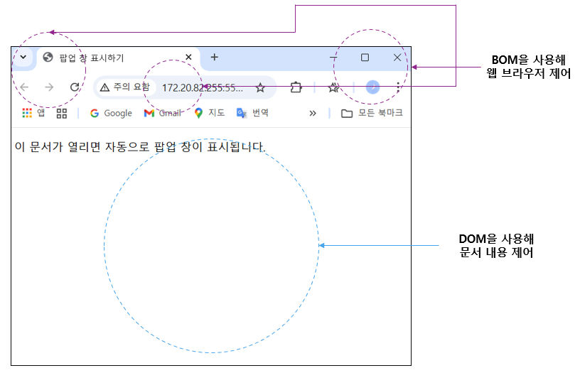
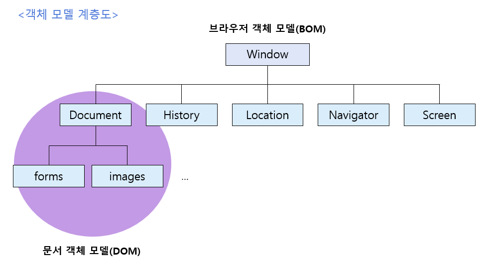
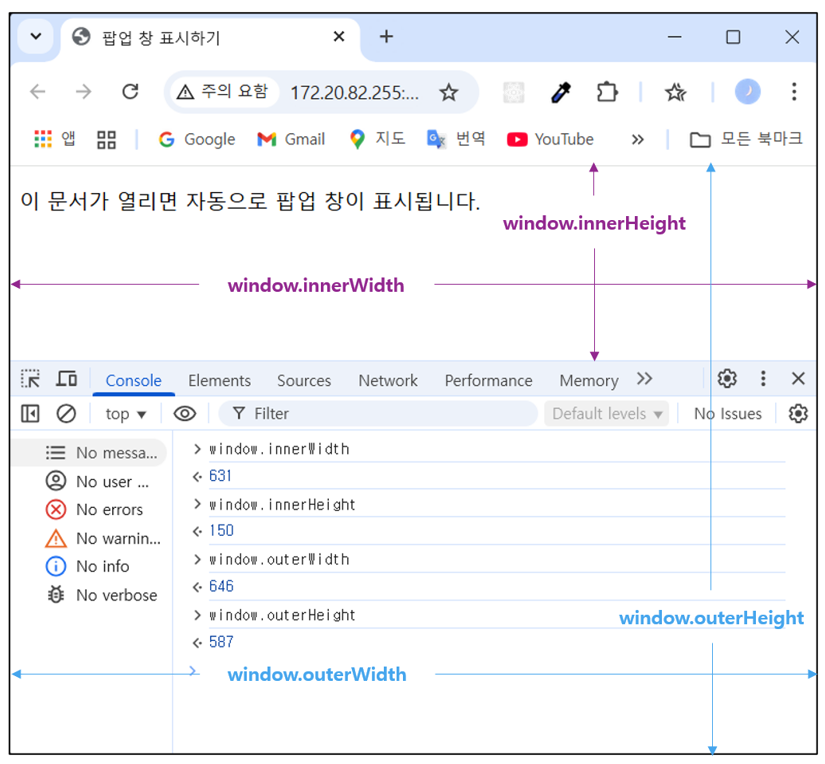
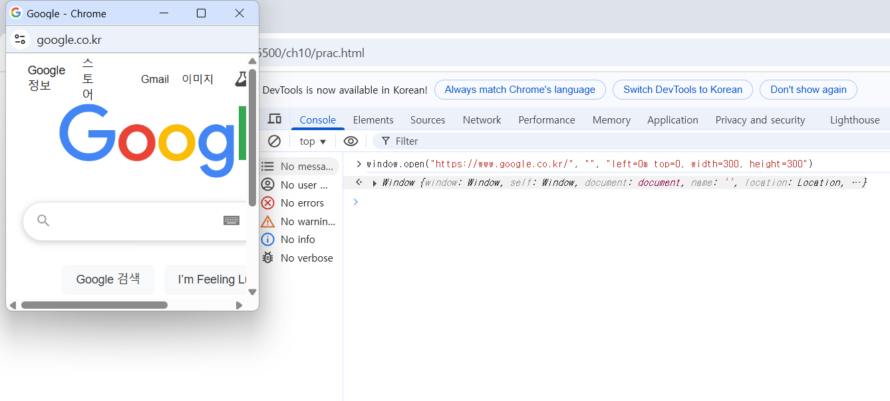

# 10-1 브라우저 객체 모델이란?
### 브라우저 객체 모델

**문서 객체 모델(DOM, Document Object Model)** : 웹 '문서'에 삽입된 각 요소를 객체로 인식하고 조작하는 것.

**브라우저 객체 모델(BOM, Browser Object Model)** : 웹 '브라우저' 전체를 객체로 관리하는 것
- JS 프로그램을 통해 브라우저 창을 관리할 수 있도록 브라우저 요소를 객체화해 놓은 것.




#### ❄️자주 사용하는 브라우저 내장 객체
|객체|설명|
|---|---|
|Window|브라우저 창이 열릴 때마다 하나씩 만들어지는 객체. 브라우저 창 안에 존재하는 모든 요소의 최상위 객체|
|Document|웹 문서에 <body> 태그를 만나면 만들어지는 객체. HTML 문서 정보를 가지고 있음.|
|History|현재 창에서 사용자의 방문 기록을 저장하고 있는 객체.|
|Location|현재 페이지에 대한 URL 정보를 가지고 있는 객체.|
|Navigator|현재 사용 중인 웹 브라우저 정보를 가지고 있는 객체.|
|Screen|현재 사용 중인 화면 정보를 다루는 객체.|

## 10-2 웹 브라우저를 제어하는 Window 객체
### Window 객체의 속성 알아보기

- 속성에 접근하는 방법 : 객체 이름 뒤에 마침표(.)와 속성 이름을 붙인다.
#### ❄️자주 사용하는 속성 (모든 브라우저에서 호환됨.)

|속성|설명|
|---|---|
|document | 브라우저 창에 표시된 웹 문서에 접근할 수 있음.|
|frameElement | 현재 창이 다른 요소 안에 포함되어 있으면 그 요소를 반환함. 포함되어 있지 않으면 null을 반환함.|
|innerHeight | 내용 영역의 높이를 나타냄.|
|innerWidth | 내용 영역의 너비를 나타냄.|
|localStorage | 웹 브라우저에서 데이터를 저장하는 로컬 스토리지를 반환함.|
|location | Window 객체의 위치/현재 URL을 나타냄.|
|name | 브라우저 창의 이름을 가져오거나 수정함.|
|outerHeight | 브라우저 창의 바깥 높이를 나타냄.|
|outerWidth | 브라우저 창의 바깥 너비를 나타냄.|
|pageXOffset | 스크롤했을 때 화면이 수평으로 이동하는 픽셀 수, scrollX와 같음.|
|pageYOffset | 스크롤했을 때 화면이 수직으로 이동하는 픽셀 수, scrollY와 같음.|
|parent | 현재 창이나 서브 프레임의 부모 프레임.|
|screenX | 브라우저 창 왼쪽 테두리가 모니터 왼쪽 테두리에서부터 떨어져 있는 거리를 나타냄.|
|screenY | 브라우저 창 위쪽 테두리가 모니터 위쪽 테두리에서부터 떨어져 있는 거리를 나타냄.|
|scrollX | 스크롤했을 때 수평으로 이동하는 픽셀 수를 나타냄.|
|scrollY | 스크롤했을 때 수직으로 이동하는 픽셀 수를 나타냄.|
|sessionStorage | 웹 브라우저에서 데이터를 저장하는 세션 스토리지를 반환함.|



### Window 객체의 함수 알아보기
- ```alert(), prompt()``` 함수는 사실 Window 객체의 함수였다.
- Window 객체는 기본 객체이므로 ```window.```을 생략하고 ```alert()```만 입력해도 사용 가능하다.

#### ❄️ Window 객체에서 자주 사용하는 함수
|함수|설명|
|---|---|
|alert() | 알림창(Alert Dialog)을 표시함.|
|blur() | 창에서 포커스를 제거함.|
|close() | 현재 열려 있는 창을 닫음.|
|confirm() | [확인], [취소]가 있는 확인창을 표시함.|
|focus() | 현재 창에 포커스를 부여함.|
|moveBy() | 현재 창을 지정한 크기만큼 이동함.|
|moveTo() | 현재 창을 지정한 좌표로 이동함.|
|open() | 새로운 창을 연다.|
|postMessege() | 다른 창으로 메시지를 전달함.|
|print() | 현재 문서를 인쇄함.|
|prompt() | 프롬프트 창에 입력한 텍스트 반환.|
|resizeBy() | 지정한 크기만큼 현재 창 크기 조절.|
|resizeTo() | 동적으로 브라우저 창의 크기를 조절.|
|scroll() | 문서에서 특정 위치로 스크롤 함.|
|scrollBy() | 지정한 크기 만큼씩 스크롤 함.|
|scrollTo() | 지정한 위치까지 스크롤 함.|
|setCusor() | 현재 창의 커서를 변경함.|
|showModaDialog() | 모들 창을 표시함.|
|sizeToContent() | 내용에 맞게 창 크기를 맞춤.|
|stop() | 로딩을 중지함.|

<br>

🔎 모달 창(Modal Window)이란?
- 이벤트 정보다 공지 내용 등을 표시하기 위해 현재 브라우저 창 위에 띄우는 새로운 창을 말한다.
- 일반적 알림 창 : 웹 브라우저 창을 새로 여는 것.
- 모달 창 : 문서 소스 안에 \<div> 태그를 사용해 삽입하고 레이어로 표시한 창.
    - 웹 브라우저에서 알림 창을 차단하더라도 모달창은 화면에 표시 가능.

<br>

#### ❄️ 새 창을 여는 open() 함수
- open() : 현재 창이나 새 탭, 새로운 알림 창 등 링크를 누르거나 웹 문서를 불러오자마자 새 창이 뜨는 함수.

> ```open()``` 함수 - 첫번째 매개변수
```javascript
window.open("https://www.google.co.kr/");
// 콘솔에 open안에 접속하려는 사이트 주소 넣으면 해당 주소 사이트가 열림.
```

> ```open()``` 함수 - 두번째 매개변수
```javascript
window.open("https://www.google.co.kr/", "");
// 아무 값도 없이 빈 따옴표만 넣을 경우에도 새 탭에 Google 사이트가 표시됨.
window.open("https://www.google.co.kr/", "_self");
// 현재 창에 새 창(Google 사이트)이 표시됨.
```

> ```open()``` 함수 - 세번째 매개변수
```javascript
window.open("https://www.google.co.kr/", "", "left=0m top=0, width=300, height=300");
// 알림 창에 Google 사이트를 표시할 때, 화면 왼쪽 위(left=0, top=0)에 너비 300px, 높이 300px 크기로 열림.
```



#### ❄️ 크기를 조절하는 resizeBy(), resizeTo() 함수
```resizeBy()``` : 현재 브라우저 창의 크기를 기준으로 너비와 높이에 값을 더해줌.
- 기존 창의 너비 값과 높이 값에 입력한 값을 각각 더해 브라우저 창의 크기를 새로 지정함.
```javascript
var newWin = window.open(" ", " ", "width=300, height=300");

newWin.resizeBy(100,100);   //알림 창의 크기를 가로/세로 100px씩 늘림
newWin.resizeBy(-100,-100); //알림 창의 크기를 가로/세로 100px씩 줄임
```
```resizeTo()``` : 최종 크기를 지정함.
- resizeTo()는 음수 값을 사용할 수 없음.

```javascript
newWin.resizeTo(200,200);   //알림 창의 크기를 가로와 세로 각각 200px로 지정
```

#### ❄️ 위치를 조절하는 moveBy(), moveTo() 함수

```moveBy()```, ```moveTo()``` : x크기와 y크기를 매개변수로 사용함.

- ```moveBy()``` : 화면 현재 위치를 기준으로 가로를 x픽셀, 세로를 y픽셀 만큼 옮김.
- ```moveTo()``` : 화면 왼쪽 위 모서리를 기준으로 가로를 x픽셀, 세로를 y픽셀 만큼 옮김.

```javascript
newWin.moveBy(500,500);   //알림 창 위치를 현재 위치에서 (500px, 500px)로 옮김.
newWin.moveTo(0,0);       //알림 창을 화면 왼쪽 위로 (0,0)로 옮김.
```

### 팝업 창 표시 프로그램 - Window 객체 함수로 팝업 창 띄우기


## 10-3 브라우저 정보가 담긴 Navigator 객체
