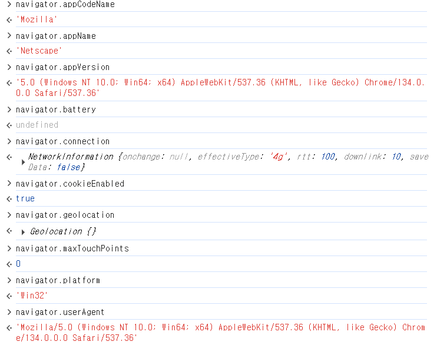

# 10-1 브라우저 객체 모델이란?
### 브라우저 객체 모델

**문서 객체 모델(DOM, Document Object Model)** : 웹 '문서'에 삽입된 각 요소를 객체로 인식하고 조작하는 것.

**브라우저 객체 모델(BOM, Browser Object Model)** : 웹 '브라우저' 전체를 객체로 관리하는 것
- JS 프로그램을 통해 브라우저 창을 관리할 수 있도록 브라우저 요소를 객체화해 놓은 것.


#### ❄️자주 사용하는 브라우저 내장 객체
|객체|설명|
|---|---|
|Window|브라우저 창이 열릴 때마다 하나씩 만들어지는 객체. 브라우저 창 안에 존재하는 모든 요소의 최상위 객체|
|Document|웹 문서에 <body> 태그를 만나면 만들어지는 객체. HTML 문서 정보를 가지고 있음.|
|History|현재 창에서 사용자의 방문 기록을 저장하고 있는 객체.|
|Location|현재 페이지에 대한 URL 정보를 가지고 있는 객체.|
|Navigator|현재 사용 중인 웹 브라우저 정보를 가지고 있는 객체.|
|Screen|현재 사용 중인 화면 정보를 다루는 객체.|

## 10-2 웹 브라우저를 제어하는 Window 객체
### Window 객체의 속성 알아보기

- 속성에 접근하는 방법 : 객체 이름 뒤에 마침표(.)와 속성 이름을 붙인다.
#### ❄️자주 사용하는 속성 (모든 브라우저에서 호환됨.)

|속성|설명|
|---|---|
|document | 브라우저 창에 표시된 웹 문서에 접근할 수 있음.|
|frameElement | 현재 창이 다른 요소 안에 포함되어 있으면 그 요소를 반환함. 포함되어 있지 않으면 null을 반환함.|
|innerHeight | 내용 영역의 높이를 나타냄.|
|innerWidth | 내용 영역의 너비를 나타냄.|
|localStorage | 웹 브라우저에서 데이터를 저장하는 로컬 스토리지를 반환함.|
|location | Window 객체의 위치/현재 URL을 나타냄.|
|name | 브라우저 창의 이름을 가져오거나 수정함.|
|outerHeight | 브라우저 창의 바깥 높이를 나타냄.|
|outerWidth | 브라우저 창의 바깥 너비를 나타냄.|
|pageXOffset | 스크롤했을 때 화면이 수평으로 이동하는 픽셀 수, scrollX와 같음.|
|pageYOffset | 스크롤했을 때 화면이 수직으로 이동하는 픽셀 수, scrollY와 같음.|
|parent | 현재 창이나 서브 프레임의 부모 프레임.|
|screenX | 브라우저 창 왼쪽 테두리가 모니터 왼쪽 테두리에서부터 떨어져 있는 거리를 나타냄.|
|screenY | 브라우저 창 위쪽 테두리가 모니터 위쪽 테두리에서부터 떨어져 있는 거리를 나타냄.|
|scrollX | 스크롤했을 때 수평으로 이동하는 픽셀 수를 나타냄.|
|scrollY | 스크롤했을 때 수직으로 이동하는 픽셀 수를 나타냄.|
|sessionStorage | 웹 브라우저에서 데이터를 저장하는 세션 스토리지를 반환함.|


### Window 객체의 함수 알아보기
- ```alert(), prompt()``` 함수는 사실 Window 객체의 함수였다.
- Window 객체는 기본 객체이므로 ```window.```을 생략하고 ```alert()```만 입력해도 사용 가능하다.

#### ❄️ Window 객체에서 자주 사용하는 함수
|함수|설명|
|---|---|
|alert() | 알림창(Alert Dialog)을 표시함.|
|blur() | 창에서 포커스를 제거함.|
|close() | 현재 열려 있는 창을 닫음.|
|confirm() | [확인], [취소]가 있는 확인창을 표시함.|
|focus() | 현재 창에 포커스를 부여함.|
|moveBy() | 현재 창을 지정한 크기만큼 이동함.|
|moveTo() | 현재 창을 지정한 좌표로 이동함.|
|open() | 새로운 창을 연다.|
|postMessege() | 다른 창으로 메시지를 전달함.|
|print() | 현재 문서를 인쇄함.|
|prompt() | 프롬프트 창에 입력한 텍스트 반환.|
|resizeBy() | 지정한 크기만큼 현재 창 크기 조절.|
|resizeTo() | 동적으로 브라우저 창의 크기를 조절.|
|scroll() | 문서에서 특정 위치로 스크롤 함.|
|scrollBy() | 지정한 크기 만큼씩 스크롤 함.|
|scrollTo() | 지정한 위치까지 스크롤 함.|
|setCusor() | 현재 창의 커서를 변경함.|
|showModaDialog() | 모들 창을 표시함.|
|sizeToContent() | 내용에 맞게 창 크기를 맞춤.|
|stop() | 로딩을 중지함.|

<br>

🔎 모달 창(Modal Window)이란?
- 이벤트 정보다 공지 내용 등을 표시하기 위해 현재 브라우저 창 위에 띄우는 새로운 창을 말한다.
- 일반적 알림 창 : 웹 브라우저 창을 새로 여는 것.
- 모달 창 : 문서 소스 안에 \<div> 태그를 사용해 삽입하고 레이어로 표시한 창.
    - 웹 브라우저에서 알림 창을 차단하더라도 모달창은 화면에 표시 가능.

<br>

#### ❄️ 새 창을 여는 open() 함수
- open() : 현재 창이나 새 탭, 새로운 알림 창 등 링크를 누르거나 웹 문서를 불러오자마자 새 창이 뜨는 함수.

> ```open()``` 함수 - 첫번째 매개변수
```javascript
window.open("https://www.google.co.kr/");
// 콘솔에 open안에 접속하려는 사이트 주소 넣으면 해당 주소 사이트가 열림.
```

> ```open()``` 함수 - 두번째 매개변수
```javascript
window.open("https://www.google.co.kr/", "");
// 아무 값도 없이 빈 따옴표만 넣을 경우에도 새 탭에 Google 사이트가 표시됨.
window.open("https://www.google.co.kr/", "_self");
// 현재 창에 새 창(Google 사이트)이 표시됨.
```

> ```open()``` 함수 - 세번째 매개변수
```javascript
window.open("https://www.google.co.kr/", "", "left=0m top=0, width=300, height=300");
// 알림 창에 Google 사이트를 표시할 때, 화면 왼쪽 위(left=0, top=0)에 너비 300px, 높이 300px 크기로 열림.
```


#### ❄️ 크기를 조절하는 resizeBy(), resizeTo() 함수
```resizeBy()``` : 현재 브라우저 창의 크기를 기준으로 너비와 높이에 값을 더해줌.
- 기존 창의 너비 값과 높이 값에 입력한 값을 각각 더해 브라우저 창의 크기를 새로 지정함.
```javascript
var newWin = window.open(" ", " ", "width=300, height=300");

newWin.resizeBy(100,100);   //알림 창의 크기를 가로/세로 100px씩 늘림
newWin.resizeBy(-100,-100); //알림 창의 크기를 가로/세로 100px씩 줄임
```
```resizeTo()``` : 최종 크기를 지정함.
- resizeTo()는 음수 값을 사용할 수 없음.

```javascript
newWin.resizeTo(200,200);   //알림 창의 크기를 가로와 세로 각각 200px로 지정
```

#### ❄️ 위치를 조절하는 moveBy(), moveTo() 함수

```moveBy()```, ```moveTo()``` : x크기와 y크기를 매개변수로 사용함.

- ```moveBy()``` : 화면 현재 위치를 기준으로 가로를 x픽셀, 세로를 y픽셀 만큼 옮김.
- ```moveTo()``` : 화면 왼쪽 위 모서리를 기준으로 가로를 x픽셀, 세로를 y픽셀 만큼 옮김.

```javascript
newWin.moveBy(500,500);   //알림 창 위치를 현재 위치에서 (500px, 500px)로 옮김.
newWin.moveTo(0,0);       //알림 창을 화면 왼쪽 위로 (0,0)로 옮김.
```

### 팝업 창 표시 프로그램 - Window 객체 함수로 팝업 창 띄우기
📁Src : [main.html](main.html), [popup.html](popup.html), [css/popup.css](css/popup.css), [js/popup.js](js/popup.js)


**popup.js**
```javascript
function openPop() {
  // 팝업 창에 열 html 파일 popup.html을 너비와 높이를 400px로 지정.
  var newWin = window.open("popup.html", " ", "width=400, height=400");
  if(newWin == null) {  //팝업이 차단되어 있다면 if문 실행
    alert("팝업이 차단되어 있습니다. 팝업 차단을 해제하고 새로고침해 주세요.");
  }
}
window.onload = openPop;  //openPop() 함수는 문서 열자마자 실행하므로 onload 이벤트 처리기로 실행.
```

## 10-3 브라우저 정보가 담긴 Navigator 객체

### 랜더링 엔진이란?
- **랜더링 엔진(Rendering Engine)** : 브라우저에서 웹 문서를 화면에 표시하기 위해 웹 문서의 태그와 스타일을 해석하는 프로그램
    - Layout Engine이라고도 불림.
    - 웹 브라우저마다 내장된 렌더링 엔진이 다르므로 HTML이나 CSS를 해석하는 방법이 다름.
    - 표준회되지 않은 CSS3 속성 앞에 -webkit- 또는 -oz- 같은 접두어(Perfix)를 붙여서 사용자가 접속한 브라우저에 맞게 렌더링 함.

#### ❄️ 브라우저 별 더스크립트 엔진
| 브라우저 | 렌더링 엔진 | 자바스크립트 엔진 |
|---|---|---|
| 크롬(Chrome) | 블링크(Blink) | V8 |
| 파이어폭스(Firefox) | 게코(Gecko) | 스파이더몽키(SpiderMonkey) |
| 인터넷익스플로러(Internet Explorer) | 트라이덴트(Trident) | 차크라(Chakra) | 
| 사파리(Safari) | 웹킷(Webkit) | 자바스크립트코어(JavascriptCore) |
| 오페라(Opera) | 블링크(Blink) | V8 |

- 직접 어떤 엔진을 사용하고 있는지 확인 가능.
- 주소 표시줄(검색창)에 아래 주소 입력. 
```
chrome://version/
```

- 크롬은 AppleWebkit로 표시됨.

<br>

### Navigator 객체의 속성 알아보기
> 객체 모든 속성 알아보기
[https://developer.mozilla.org/ko/docs/Web/API/Navigator](https://developer.mozilla.org/ko/docs/Web/API/Navigator)

- Navigator 객체 정보는 콘솔에 navigator 입력하면 볼 수 있다.

#### ❄️ Navigator 객체의 여러 가지 주요 속성
| 속성 | 설명 |
|---|---|
| appCodeName | 브라우저 이름(코드 이름)을 문자열로 반환. |
| appName | 브라우저 공식 이름을 문자열로 반환. | 
| appVersion | 브라우저 버전을 문자열로 반환. |
| battery | 배터리 충전 상태를 알려주는 정보가 담긴 객체를 반환. |
| connection | 브라우저 장치의 네트워크 정보가 담긴 객체를 반환. |
| cookieEnabled | 쿠키 정보를 무시한다면 false, 그렇지 않으면 true를 반환. |
| geolocation | 모바일 기기를 사용한 위치 정보가 담긴 객체를 반환. |
| maxTouchPoints | 장치에서 동시에 터치 가능한 포인트가 몇 개인지 반환. |
| platform | 브라우저 플랫폼 정보를 가지고 있는 문자열 반환. |
| userAgent | 현재 브라우저 정보가 있는 사용자 에이전트(User Agent) 문자열을 반환. |



<br>

> Navigator 객체 중 브라우저 정보를 담고 있는 일부 속성 표시<br>
📁Src : [browser.html](browser.html)

- chrome browser

- firefox browser


<br>

### 사용자 에이전트 문자열로 자바스크립트 엔진 확인하기
- Navigator 객체 정보 중 userAgent 속성에 사용자의 웹 브라우저 버전 및 자바스크립트 엔진 정보 등을 알 수 있다.
- 사용자 에이전트(User Agent) 문자열 : client에서 server로 정보를 보낼 때 client에서 함께 보내는 정보
    - server에서는 이 정보를 보고 브라우저 종류를 확인한 후, 해당 브라우저에 맞게 웹 페이지를 표시함.
    - navigator.useragent에 포함되어 있음.

> 여러 버전의 사용자 문자열 알아보기
[https://www.useragentstring.com/pages/useragentstring.php](https://www.useragentstring.com/pages/useragentstring.php)

> 에이전트 문자열을 사용해 웹 브라우저 종류를 확인하기<br>
📁Src : [browserCheck.html](browserCheck.html)

- chrome browser


## 10-4 그 밖의 브라우저 객체들

### History 객체 간단히 살펴보기
- **History 객체** : 브라우저에서 '뒤로', '앞으로' 또는 주소 표시줄에 입력해서 돌아다녔던 사이트 주소가 저장되어 있음.
    - 보안 문제로 읽기 전용임.
    - 이 객체에서 사용할 수 있는 함수 : 방문하면서 History 객체에 저장된 URL을 앞뒤로 이동.

#### ❄️ History 객체의 속성과 함수
| 속성 | 설명 |
|---|---|
| length | 현재 브라우저 창의 History 목록에 있는 항목의 개수. 방문한 사이트 개수 반환함.|

| 함수 | 설명 |
|---|---|
| back() | History 목록에서 이전 페이지를 현재 화면에 불러옴. |
| forward() | History 목록에서 다음 페이지를 현재 화면에 불러옴. |
| go() | History 목록에서 현재 페이지를 기준으로 상대 위치에 있는 페이지를 현재 화면에 불러옴. <br> ex) history.go(1) : 다음 페이지를 가져옴.<br>history.go(-1) : 이전 페이지를 불러옴.


<br>

### Location 객체 간단히 살펴보기
- **Location 객체** : 브라우저의 주소 표시줄과 관련됨. 현재 문서의 URL 주소 정보를 가지고 있음.
    - 이 정보를 편집하면 현재 프라우저 창에 열릴 사이트나 문서를 지정할 수 있음.

#### ❄️Location 객체의 속성과 함수
| 속성 | 설명 |
|---|---|
| hash | URL 중 #으로 시작해서 해시 부분을 나타냄. |
| host | URL의 호스트 이름과 포트 번호를 나타냄. | 
| hostname | URL의 호스트 이름을 나타냄. |
| href | 전체 URL. 이 값을 변경하면 해당 주소로 이동 가능. |
| pathname | URL 경로를 나타냄. |
| port | URL의 포트 번호를 나타냄. |
| protocol | http:// 나 ftp:// 같은 URL의 프로토콜을 나타냄. |
| password | 도메인 이름 앞에 username와 password를 함께 입력해서 접속하는 URL일 경우 password 정보를 저장함. |
| search | URL 중 ?(물음표)로 시작하는 검색 내용 부분을 나타냄. |
| username | 도메인 이름 앞에 username을 함께 입력해서 접속하는 사이트 URL일 경우 username 정보를 저장함. |

| 함수 | 설명 |
|---|---|
| assign() | 현재 문서에 새 문서 주소를 할당해 새 문서를 가져옴. |
| reload() | 현재 문서를 다시 불러옴. 브라우저의 [새로 고침]과 같은 역할을 함. |
| replace() | 현재 문서의 URL을 지우고 다른 URL의 문서로 교체함. |
| toString() | 현재 문서의 URL을 문자열로 반환함. |

> location 객체의 일부 속성을 가져와 보여주는 소스<br>
📁Src : [locationObject.html](locationObject.html)


<br>

### Screen 객체 간단히 살펴보기
- **Screen 객체** : 웹 사이트를 접속하는 사용자의 화면 크기는 모두 다른데, 화면 크기나 정보를 알고 싶을 때 사용함.
    - 주로 화면 정보를 알아낼 때 많이 사용함.

#### ❄️Screen 객체의 속성과 함수
| 속성 | 설명 |
|---|---|
| availHeight | 화면에서 윈도우 작업 표시줄이나 맥의 메뉴/독 같은 UI 영역을 제외한 부분의 높이를 나타냄. |
| availWidth | UI 영역을 제외한 부분의 너비를 나타냄. |
| colorDepth | 화면상에서 픽셀을 렌더링할 때 사용하는 색상 수를 나타냄. |
| height | UI 영역을 포함한 화면의 높이를 나타냄. |
| orientation | 화면의 현재 방향을 나타냄. 기본은 가로 방향. |
| pixelDepth | 화면상에서 픽셀을 랜더링할 때 사용하는 비트 수를 나타냄. |
| width | UI 영역을 포함한 화면의 너비를 나타냄. |

| 함수 | 설명 |
|---|---|
| lockOrientation() | 화면 방향을 잠금. |
| unlockOrientation() | 화면 방향 잠금을 해제함. |


